# SQL Challenges & Performance

Answers to the six PostgreSQL challenges. Each query is shown with its result screenshot.

Screenshots live in [`images/`](images/). Add the image files there and they render below.

---

## 1. Modelling

The galaxy schema: two facts (`fact_sales`, `fact_coupon_redemption`) sharing dimensions, plus two bridges. Full DDL is in [`sql/schema.sql`](sql/schema.sql).

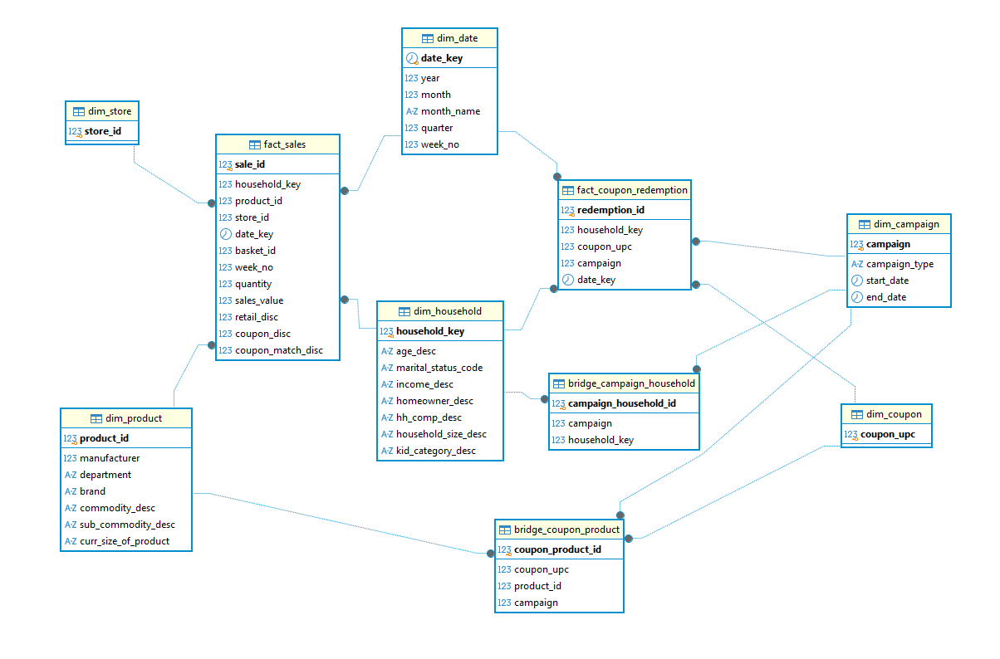

---

## 2. Aggregation & grouping

Revenue by department and by year/month, highest to lowest.

```sql
SELECT p.department, d.year, d.month_name,
       ROUND(SUM(f.sales_value), 2) AS revenue
FROM   gold.fact_sales   f
JOIN   gold.dim_product  p ON p.product_id = f.product_id
JOIN   gold.dim_date     d ON d.date_key   = f.date_key
GROUP  BY p.department, d.year, d.month, d.month_name
ORDER  BY revenue DESC;
```

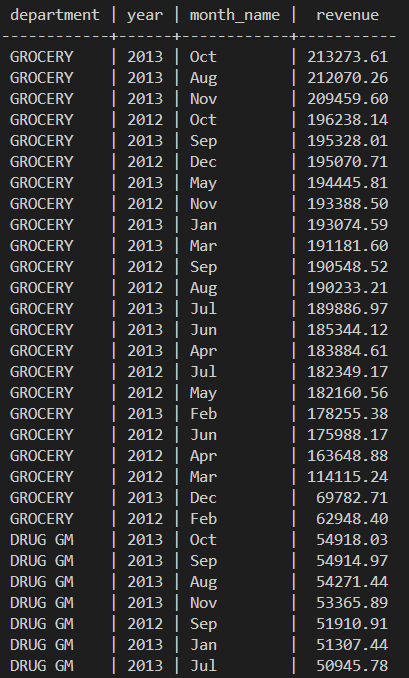

---

## 3. Window function - RANK

Top 5 commodities within each department, ordered by each department's total revenue.

```sql
WITH ranked AS (
    SELECT p.department, p.commodity_desc,
           SUM(f.sales_value) AS revenue,
           RANK() OVER (PARTITION BY p.department ORDER BY SUM(f.sales_value) DESC) AS rank,
           SUM(SUM(f.sales_value)) OVER (PARTITION BY p.department) AS dept_revenue
    FROM   gold.fact_sales  f
    JOIN   gold.dim_product p ON p.product_id = f.product_id
    GROUP  BY p.department, p.commodity_desc
)
SELECT department, commodity_desc, ROUND(revenue, 2) AS revenue, rank
FROM   ranked
WHERE  rank <= 5
ORDER  BY dept_revenue DESC, rank;
```

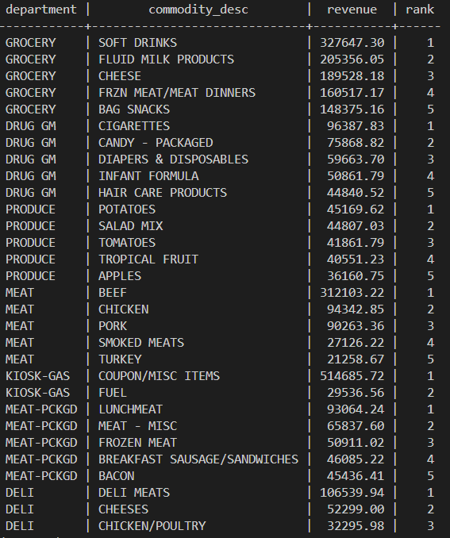

---

## 4. Joins

The sales fact joined to all four of its dimensions (one row per sales line).

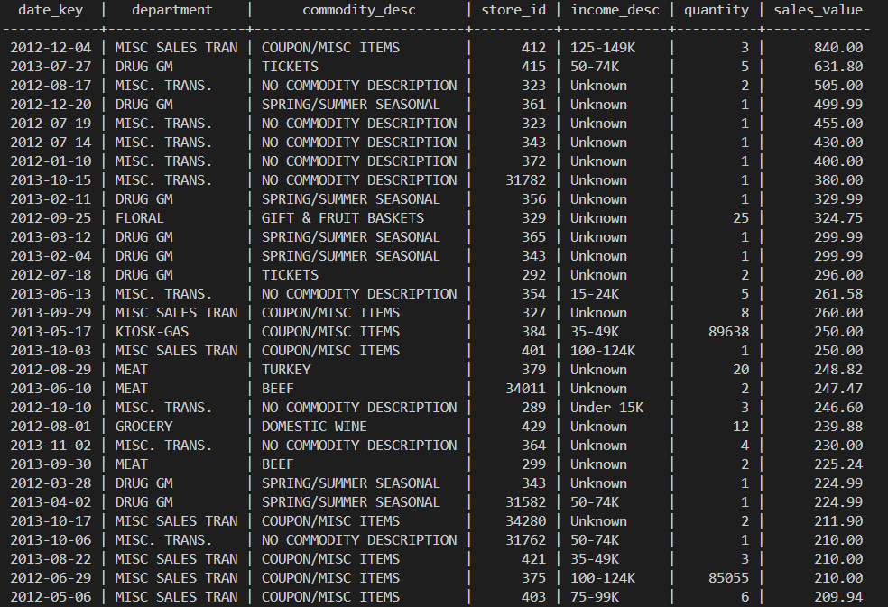

## 4b. Joins - marketing side

`fact_coupon_redemption` joined to its four dimensions (one row per redemption).

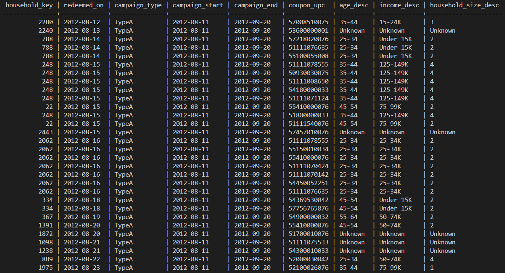

---

## 5. Performance - index before/after

A single-day revenue query, before and after adding an index on `fact_sales(date_key)`.

```sql
EXPLAIN (ANALYZE, BUFFERS)
SELECT SUM(sales_value)
FROM   gold.fact_sales
WHERE  date_key = DATE '2012-10-15';

CREATE INDEX IF NOT EXISTS idx_fact_sales_date ON gold.fact_sales (date_key);
ANALYZE gold.fact_sales;

EXPLAIN (ANALYZE, BUFFERS)
SELECT SUM(sales_value)
FROM   gold.fact_sales
WHERE  date_key = DATE '2012-10-15';
```

**Before (no index):** Parallel Seq Scan - reads the whole table.

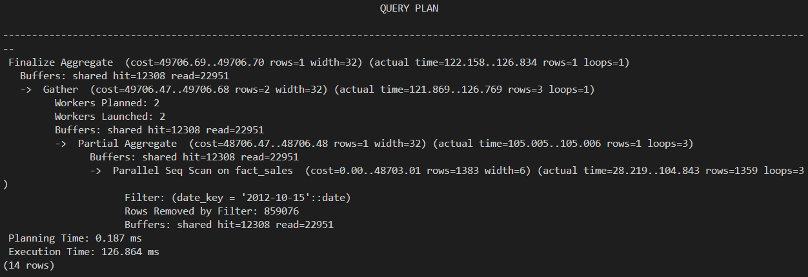

**After (with index):** Index Scan on `idx_fact_sales_date` - reads only the matching rows.

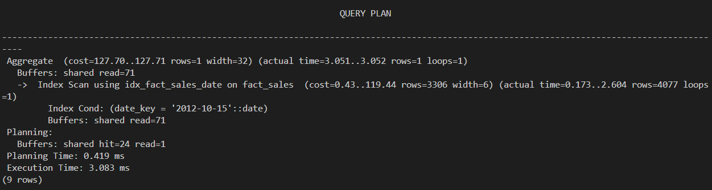

| | Before | After |
|---|---|---|
| Plan | Parallel Seq Scan | Index Scan on `idx_fact_sales_date` |
| Execution time | 126.9 ms | 3.1 ms (~41x faster) |
| Buffers read | 35,259 pages (hit 12,308 + read 22,951) | 71 pages |
| Rows removed by filter | 859,076 | 0 |

---

## 6. Data quality - bronze, silver, gold 

### 6a. Bronze - detect the issues

**06_01 - Column names (bronze).** The raw CSV names arrive mixed-case and inconsistent (e.g. `BASKET_ID`, `household_key`). Silver will standardise these.

```sql
SELECT table_name, column_name, data_type
FROM   information_schema.columns
WHERE  table_schema = 'bronze'
ORDER  BY table_name, ordinal_position;
```

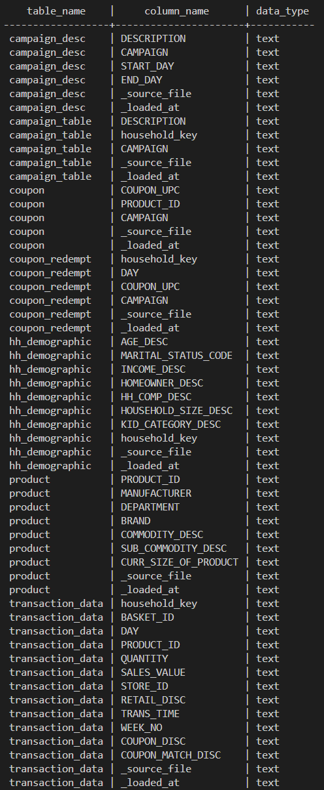

**06_02 - Coupon duplicate rows.** The raw `coupon` file has ~5,164 exact duplicate rows (`total_rows` > `distinct_rows`).

```sql
SELECT COUNT(*)                                                          AS total_rows,
       COUNT(DISTINCT ("COUPON_UPC","PRODUCT_ID","CAMPAIGN"))            AS distinct_rows,
       COUNT(*) - COUNT(DISTINCT ("COUPON_UPC","PRODUCT_ID","CAMPAIGN")) AS duplicate_rows
FROM   bronze.coupon;
```

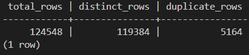

**06_03 - Positive `retail_disc`.** A few discounts are stored as positive values (max +3.99), when a discount should be `<= 0`.

```sql
SELECT COUNT(*) AS positive_rows, MAX("RETAIL_DISC"::numeric) AS max_retail_disc
FROM   bronze.transaction_data
WHERE  "RETAIL_DISC"::numeric > 0;
```

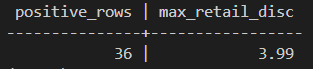

**06_04 - Blank product fields.** 15 rows have a blank department/commodity/sub-commodity, and 30,607 have a blank size.

```sql
SELECT COUNT(*) FILTER (WHERE TRIM("DEPARTMENT")           = '') AS blank_department,
       COUNT(*) FILTER (WHERE TRIM("COMMODITY_DESC")       = '') AS blank_commodity,
       COUNT(*) FILTER (WHERE TRIM("SUB_COMMODITY_DESC")   = '') AS blank_sub_commodity,
       COUNT(*) FILTER (WHERE TRIM("CURR_SIZE_OF_PRODUCT") = '') AS blank_size
FROM   bronze.product;
```

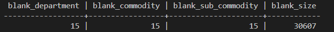

### 6b. Silver - confirm resolved

**06_05 - Column names (silver).** Now all lowercase `snake_case`.

```sql
SELECT table_name, column_name, data_type
FROM   information_schema.columns
WHERE  table_schema = 'silver'
ORDER  BY table_name, ordinal_position;
```

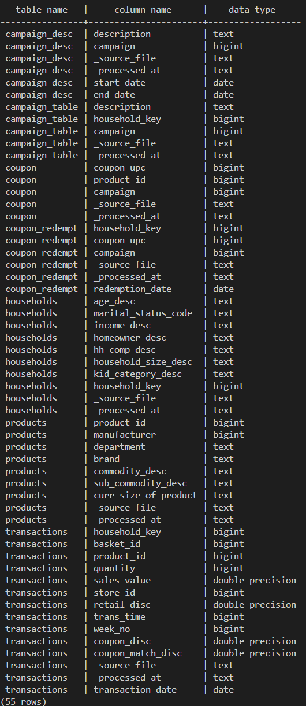

**06_06 - Coupon duplicates removed.** `duplicate_rows = 0`.

```sql
SELECT COUNT(*) - COUNT(DISTINCT (coupon_upc, product_id, campaign)) AS duplicate_rows
FROM   silver.coupon;
```

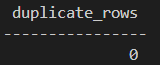

**06_07 - Blanks filled with `UNKNOWN`.** 15 `unknown_department` and 30,607 `unknown_size`.

```sql
SELECT COUNT(*) FILTER (WHERE department          = 'UNKNOWN') AS unknown_department,
       COUNT(*) FILTER (WHERE curr_size_of_product = 'UNKNOWN') AS unknown_size
FROM   silver.products;
```

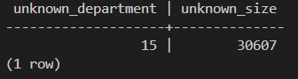

**06_08 - No positive `retail_disc`.** `positive_rows = 0`.

```sql
SELECT COUNT(*) AS positive_rows
FROM   silver.transactions
WHERE  retail_disc > 0;
```

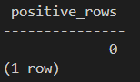

### 6c. Gold - integrity report

**06_09 - Data-quality report.** All foreign-key orphan checks are 0 (integrity holds by construction), negatives are 0, positive `retail_disc` is 0, and there are 15 Unknown-department products.

```sql
SELECT 'orphan_product_fk'   AS check_name, COUNT(*) AS issues
FROM gold.fact_sales f LEFT JOIN gold.dim_product   p ON p.product_id=f.product_id     WHERE p.product_id     IS NULL
UNION ALL
SELECT 'orphan_household_fk', COUNT(*)
FROM gold.fact_sales f LEFT JOIN gold.dim_household h ON h.household_key=f.household_key WHERE h.household_key IS NULL
UNION ALL
SELECT 'orphan_store_fk',     COUNT(*)
FROM gold.fact_sales f LEFT JOIN gold.dim_store     s ON s.store_id=f.store_id           WHERE s.store_id      IS NULL
UNION ALL
SELECT 'orphan_date_fk',      COUNT(*)
FROM gold.fact_sales f LEFT JOIN gold.dim_date      d ON d.date_key=f.date_key           WHERE d.date_key      IS NULL
UNION ALL
SELECT 'orphan_redemption_coupon_fk',   COUNT(*)
FROM gold.fact_coupon_redemption r LEFT JOIN gold.dim_coupon   dc ON dc.coupon_upc=r.coupon_upc WHERE dc.coupon_upc IS NULL
UNION ALL
SELECT 'orphan_redemption_campaign_fk', COUNT(*)
FROM gold.fact_coupon_redemption r LEFT JOIN gold.dim_campaign dk ON dk.campaign=r.campaign     WHERE dk.campaign   IS NULL
UNION ALL
SELECT 'orphan_couponproduct_product_fk', COUNT(*)
FROM gold.bridge_coupon_product bp LEFT JOIN gold.dim_product dp ON dp.product_id=bp.product_id WHERE dp.product_id IS NULL
UNION ALL
SELECT 'negative_sales',        COUNT(*) FROM gold.fact_sales WHERE sales_value < 0
UNION ALL
SELECT 'negative_quantity',     COUNT(*) FROM gold.fact_sales WHERE quantity < 0
UNION ALL
SELECT 'positive_retail_disc',  COUNT(*) FROM gold.fact_sales WHERE retail_disc > 0
UNION ALL
SELECT 'unknown_dept_products', COUNT(*) FROM gold.dim_product WHERE department = 'UNKNOWN'
ORDER BY issues DESC;
```

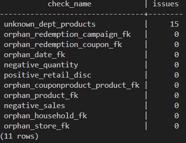

---

