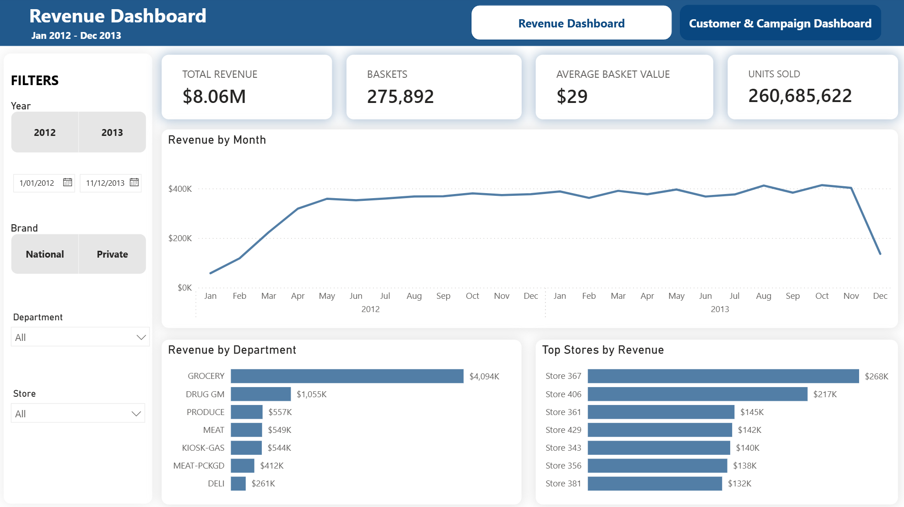
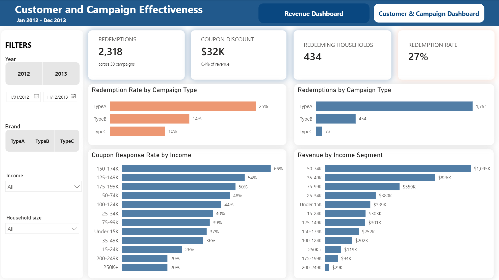

# Retail Analytics Pipeline 

A small end-to-end data pipeline that turns raw grocery data into a clean, modelled database and a Power BI dashboard.

It follows the **Medallion** pattern in PostgreSQL:

- **bronze** - the raw CSVs
- **silver** - cleaned tables
- **gold** - a galaxy model (facts + dimensions) that feeds the dashboard

---

## Data source & ingestion

- **Source:** dunnhumby "The Complete Journey" - [Kaggle dataset](https://www.kaggle.com/datasets/frtgnn/dunnhumby-the-complete-journey). About two years of grocery data across several related tables: transactions, products, household demographics, campaigns, and coupons.
- **How it is ingested:** `src/ingest.py` uses the **Kaggle Python client** (not a manual download): `KaggleApi().authenticate()` reads a token from `.env`, then `dataset_download_files()` pulls and unzips the CSVs into `data/bronze/`. 
- **Secrets:** all credentials (database + Kaggle token) live in a git-ignored `.env`; `.env.example` documents the variables without exposing values.

---

## Pre-requisites

Install these once:

1. **Docker Desktop** - https://www.docker.com/products/docker-desktop/ (runs the database + pipeline, so PostgreSQL + Python istallation not needed)
2. **A free Kaggle account** - to download the dataset **with the API** (Step 1). This is optional: you can instead download the CSVs manually from the [dataset page](https://www.kaggle.com/datasets/frtgnn/dunnhumby-the-complete-journey), unzip them into `data/bronze/`, and skip Step 1.
3. **Power BI Desktop** (Windows) - dashboard

Make sure Docker Desktop is open and running before you start.

---

## Project layout

```
fmcg-analytics/
├── src/                   # the pipeline code (run in order)
│   ├── config.py          # database connection
│   ├── logging_config.py  # shared console logger
│   ├── ingest.py          # 1. download the data from Kaggle
│   ├── bronze.py          # 2. load raw CSVs into the bronze schema
│   ├── inspect_data.py    #    (optional) profile the raw data
│   ├── silver.py          # 3. clean the data into the silver schema
│   └── gold.py            # 4. build the gold model (runs the sql/gold/ files)
├── sql/
│   ├── schema.sql         # gold table definitions (DDL, run first by gold.py)
│   ├── gold/              # one load file per gold table (01_dim_date.sql ... 10_bridge_coupon_product.sql)
│   └── challenges.sql     # the PostgreSQL challenge answers
├── images/                # dashboard + SQL result screenshots
├── docker-compose.yml     # starts PostgreSQL, and the Python pipeline container
├── Dockerfile             # builds the Python pipeline image
├── requirements.txt       # Python packages
├── .env.example           # template for your secrets
├── dashboard.pbix         # the Power BI dashboard
├── README.md
└── README-performance.md  # SQL challenge queries + result screenshots
```

---

## Setup

All commands are for **Windows PowerShell**, run from inside the `fmcg-analytics` folder.

### 1. Create your `.env` file

Copy the template and open it:

```bash
copy .env.example .env
```

Fill in a database password and your Kaggle token. Your `.env` should look like this:

```
POSTGRES_USER=fmcg
POSTGRES_PASSWORD=fmcg_local_pw
POSTGRES_DB=fmcg
POSTGRES_HOST=localhost
POSTGRES_PORT=5432
KAGGLE_API_TOKEN=your_kaggle_api_token   # only needed for Step 1
```

**To get your Kaggle token:** go to Kaggle -> your profile -> **Settings** -> API Tokens -> **Create New Token**.
Copy the token value into `KAGGLE_API_TOKEN`.

> **The raw CSVs are already included in `data/bronze/`**, so you can skip Step 1 and leave out `KAGGLE_API_TOKEN` entirely - only the `POSTGRES_*` lines are required. Keep the token only if you want to re-download the data from Kaggle.


### 2. Start the database and build the pipeline image

```bash
docker compose up -d db
```
```bash
docker compose build app
```

The first command starts PostgreSQL in the background (the data is saved between restarts, so you only do this once). The second builds the pipeline image: it reads the `Dockerfile`, which installs the Python packages listed in `requirements.txt` inside the container.

---

## Run the pipeline

Run each step one at a time. `docker compose run --rm app` runs one command inside the pipeline container and removes the container afterwards.

### Step 1 - Download the data

```bash
docker compose run --rm app python -m src.ingest
```
Downloads the dataset from Kaggle into `data/bronze/`.

> **No Kaggle API?** Skip this step.

### Step 2 - Load raw data into bronze

```bash
docker compose run --rm app python -m src.bronze
```
Loads every CSV into the `bronze` schema exactly as-is (all text).

### Step 3 (optional) - Look at the raw data

```bash
docker compose run --rm app python -m src.inspect_data
```
Prints a profile of each table (missing values, ranges, duplicates). This is to have a quick view of data for further inspection.

### Step 4 - Clean the data into silver

```bash
docker compose run --rm app python -m src.silver
```
Cleans each table: fixes column names, sets the correct data types, rounds money columns to 2 decimals, turns the relative `DAY` number into a real date, fills blank categories with `UNKNOWN`, removes duplicate and non-sale rows, and flips positive `RETAIL_DISC` values to negative.

### Step 5 - Build the gold model

```bash
docker compose run --rm app python -m src.gold
```
Builds the galaxy model that the dashboard uses. It runs `sql/schema.sql` (the table definitions), then runs each load file in `sql/gold/` in order (dimensions first, then facts and bridges), filling the tables from silver.

---

## Run the SQL challenges

The six challenge queries with their result screenshots are written up in **[README-performance.md](README-performance.md)**.

Open `sql/challenges.sql` in a database tool (for example DBeaver, connecting to `localhost:5432`, database `fmcg`, user `fmcg`) and run the queries.

Or open an interactive database session and run the queries one at a time (paste each query, ending with `;`):

```bash
docker exec -it fmcg_postgres psql -U fmcg -d fmcg
```

---

## Open the dashboard

1. Open `dashboard.pbix` in Power BI Desktop.
2. If it asks for connection, the connection to PostgreSQL is `localhost` / port `5432` / database `fmcg`.

---

## Business questions

**Revenue (dashboard page 1):** how is revenue trending; which departments drive it; which stores generate the most; and the overall scale (revenue, baskets, average basket value, units).

**Customer & campaign effectiveness (page 2):** which campaign type is most effective (redemption rate); which drives the most volume; who responds most to coupons and who is most valuable (who to target); and how much discount coupons give away as a share of revenue.

---

## Key decisions & assumptions

**Bronze**
- Every column loaded as text plus `_source_file` and `_loaded_at`.
- `causal_data.csv` is excluded for this project.

**Silver**
- Column names lowercased to `snake_case`; types cast.
- `DAY` is a relative index (1-711), not a real date, so it is anchored to `2012-01-01`. The absolute dates are therefore synthetic.
- Money rounded to 2 decimals; positive `retail_disc` flipped to negative (assumed sign errors); blank product categories -> `UNKNOWN`; 5,164 duplicate coupon rows dropped; 14,399 zero-quantity/zero-value non-sale rows removed.

**Gold**
- Galaxy schema: `fact_sales` + `fact_coupon_redemption` share dimensions, plus two bridges; primary and foreign keys enforce integrity.
- `dim_household` is built from every household seen in silver (`transactions`, `campaign_table`, `coupon_redempt`), left-joined to the 801 `households` rows (missing -> `Unknown`).

---

## Dashboard & insights

Two Power BI pages on the gold layer (Import mode) with slicers on each, and a button to switch between them.

**Page 1 - Revenue**


- The business turns over about **$8.06M** in net revenue across the two years, from **275,892 baskets** at an average basket of **$29**.
- Revenue is heavily concentrated in one department: **Grocery alone is about $4M, roughly half of all revenue**, with Drug GM a distant second at $1M and every other department under $560K.
- Stores are similarly concentrated: the top two (Store 367 and Store 406) take $268K and $217K, well ahead of the rest.

**Page 2 - Customer & campaign effectiveness**


**Campaigns:** 
- Across all campaigns, about **27%** of enrolled households redeem a coupon, and coupons give away only about **$32K, roughly 0.4% of revenue**, so promotions are a small share of margin.
- **Type A campaigns lead on both measures:** the highest redemption rate (**25%**) and the highest redemption volume (**1,791 redemptions**), followed by Type B, and Type C.

=> Concentrate spend on Type A style campaigns. Type C, at a 10% rate and only 73 redemptions, is barely worth running.

**Who to target:** 
- **Response:** Coupon response is highest among the **100-200K earners**, followed by the **under-100K earners.** The **200K+ earners barely respond** (about 20%).
- **Revenue:** the **under 100K earners generate the great majority of sales** among profiled households.

⇒ **target the 100-200K earners** with coupons, since they respond the most. **Keep the under-100K earners as usual**, since they bring in most of the revenue. The **200K+ group is small and rarely responds**, so it is not worth targeting.

---

## Limitations

- Dates are anonymised, so weekday and exact-calendar analysis is not meaningful.
- The last month is partial and should be excluded from trend reading.
- `dim_store` has no descriptive attributes because the source provides none.

---
